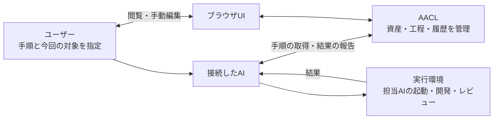
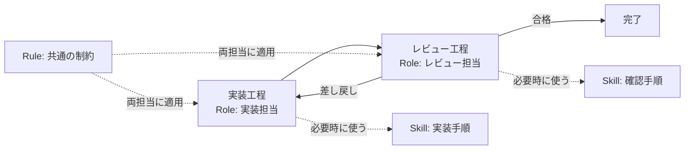
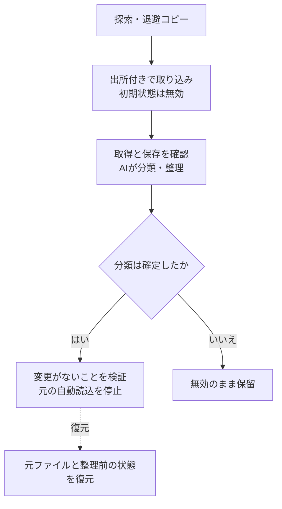
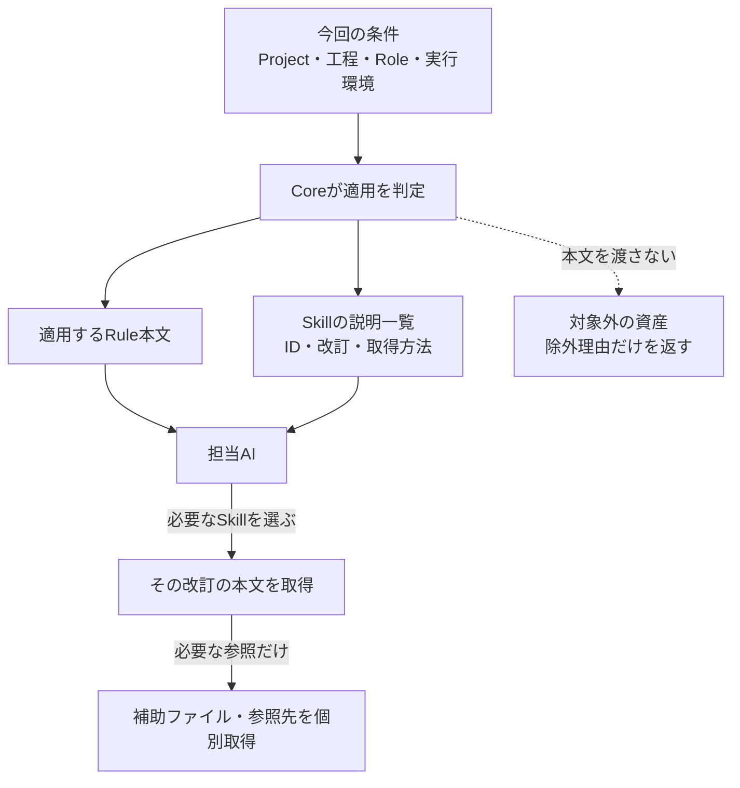
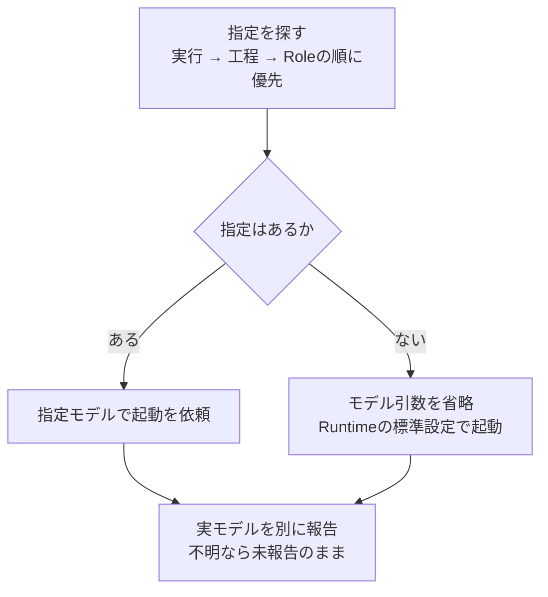
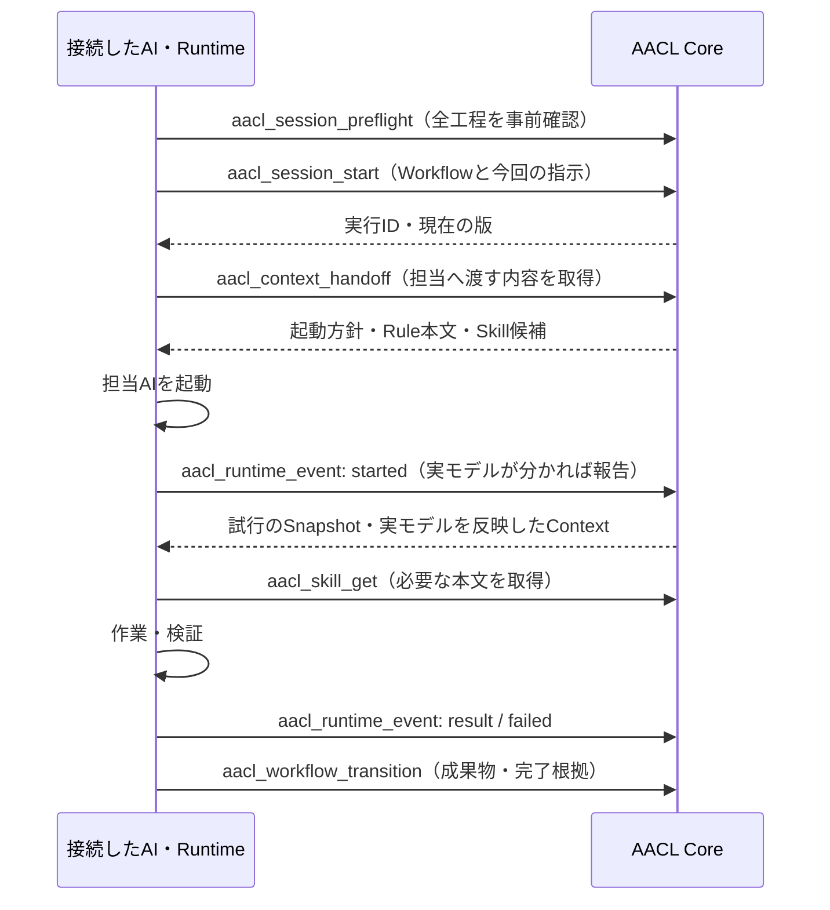
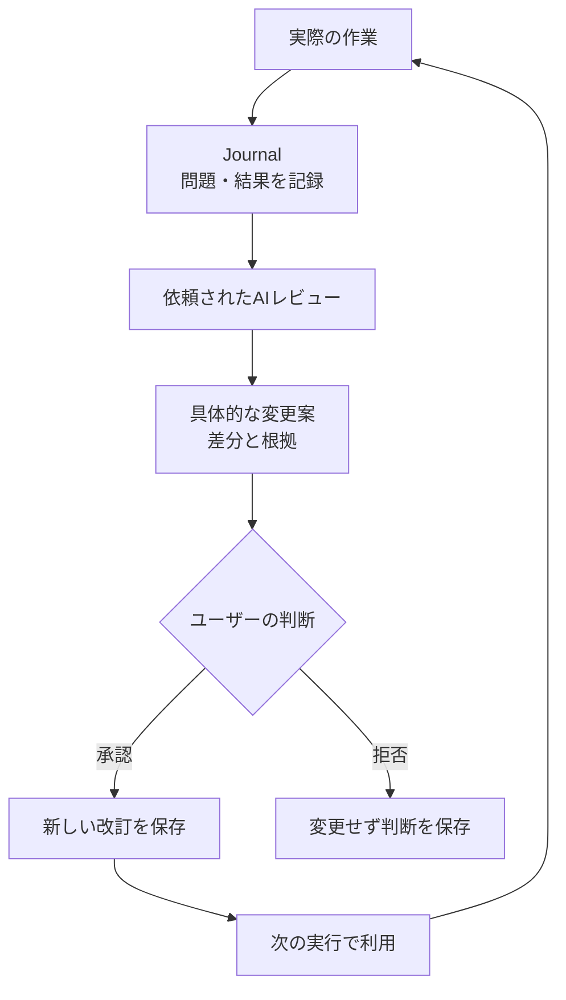
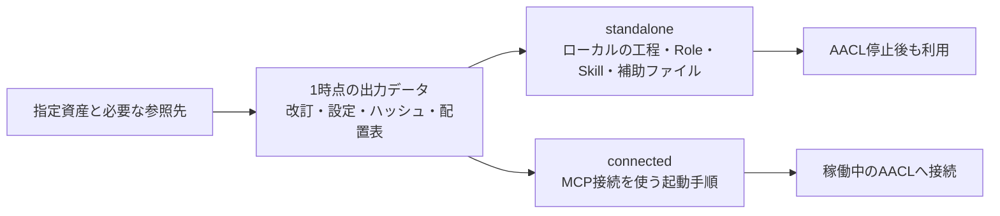

# Agent Asset Control Layer

[English](README.md) | **日本語**

**AACLは、AIと進める開発手順を保存し、繰り返し使い、実行記録から改善するローカルアプリです。**

最初に既存の指示を取り込むか、AIに手順の作成を依頼します。次回からは、保存したWorkflow（開発工程）と今回の対象を指定します。

```text
/issue-development #123 ログイン時の不具合を修正してください
```

これは`issue-development`を登録した場合の依頼例です。AACLが手順と状態を管理し、接続したAIの実行環境がコード変更やレビューを行います。



**現在利用できるもの:** ローカルCore、ブラウザUI、MCP接続、CLI、既存資産の導入、単独ファイルへの出力。Coreは保存と検証を行うサービスです。MCPはAIがその操作を呼び出すための接続規約、CLIは端末からの操作手段です。

## 始める

Node.js 24以上を用意し、最初の一度だけ、このリポジトリのルートでビルドとCLIのインストールを行います。現在は手元のリポジトリからインストールします。

```sh
npm ci
npm run build
npm install --global .
npm start
```

Coreを起動したまま、別の端末で管理対象のProjectへ移動して登録します。Coreと同じOS環境で実行してください。

```sh
cd my-project
aacl init
```

`aacl init`は現在のProjectをAACL管理下に登録します。Project IDはProject自身の`.aacl/project.json`に保存し、CoreがそのIDと場所を登録して把握します。再実行すると既存のProject IDを返します。AACL本体の作業ディレクトリへ戻る必要はありません。

対象を明示する場合は`aacl init /path/to/project`を使います。どちらも同じCore APIの`initProject`を呼びます。開発用の`npm run cli -- init ../my-project`も引き続き利用できます。

| 接続方法            | 設定                                                                |
| ------------------- | ------------------------------------------------------------------- |
| ブラウザUI          | `http://localhost:4780`を開きます。                                 |
| MCPのHTTP接続       | AIの接続先に`http://localhost:4780/mcp`を設定します。               |
| MCPの標準入出力接続 | Coreを起動したまま、コマンドを`aacl`、引数を`["mcp"]`に設定します。 |

標準入出力の接続は、稼働中のCoreへの中継です。`aacl mcp`は作業場所に依存せず、標準出力にはMCP通信だけを出します。開発用にインストール前のコマンドを使う場合は、`npm --silent run mcp`も利用できます。`--silent`はnpmの起動ログがMCPの通信に混ざることを防ぎます。接続後は「このプロジェクトの既存の開発手順を取り込んで整理してください」とAIに依頼できます。資産がない場合は、新しいWorkflowの作成を依頼するか、UIから編集可能なスターターを追加します。モデルの登録は任意です。

| 環境変数        | 用途・既定値                                                |
| --------------- | ----------------------------------------------------------- |
| `AACL_DATA_DIR` | Coreの保存先。既定はリポジトリ内の`.aacl-data`です。        |
| `PORT`          | Coreのポート。既定は`4780`です。                            |
| `AACL_URL`      | 標準入出力の中継先。既定は`http://127.0.0.1:4780/mcp`です。 |
| `AACL_API_URL`  | CLIの接続先。既定は`http://127.0.0.1:4780`です。            |

Coreは`127.0.0.1`で待ち受けます。ポートを変えた場合は、AIとCLIの接続先も合わせます。

## 手順を資産として保存する

再利用する指示や知識を**Asset（資産）**と呼びます。資産にはID、改訂番号、適用条件、参照関係を保存します。

| 種類       | 保存するもの                                           |
| ---------- | ------------------------------------------------------ |
| Workflow   | 工程、担当Role、委譲、成果物、差し戻し、完了条件。     |
| Role       | 担当者の責務と期待する成果物。                         |
| Skill      | 現在の担当者が使う手順・知識と補助ファイル。           |
| Rule       | 条件に合う作業で守る指示。                             |
| Task Type  | 作業の目的、品質基準、制約。                           |
| Capability | 外部ツールの接続と利用許可。                           |
| その他     | プロジェクト知識、方針、テンプレート、未分類資産など。 |

Workflowが担当を決め、担当者が必要なSkillを使います。次は、実装とレビューを分ける構成例です。



Skillは担当やモデルを選びません。同じ担当者が行う順序付きの手順はSkillに書けます。別担当への委譲や工程の制御はWorkflowに保存します。旧`skill.steps`は読み取れますが実行せず、新規保存も拒否します。

リポジトリを変更する作業には、開発を許可したWorkflowの明示起動が必要です。Workflowなしの会話や単独Skillは相談・準備として扱います。AACL内の資産編集は、ユーザーの依頼に基づく別の管理操作です。

UIでは工程、担当、成果物、差し戻し先を編集できます。以下の画面は説明用データで撮影しています。


## 既存の指示を取り込む

単一Markdownの登録と、既存環境の移行は、次の入口から使えます。

| やりたいこと | 画面の入口 | 保存・変更するもの |
| --- | --- | --- |
| 1ファイルを資産として登録する | Assets → インポート → 「単一Markdownを登録」 | 本文と説明を有効な資産として保存します。元のパス・ハッシュ・補助ファイルは保存せず、元ファイルも変更しません。 |
| 既存の指示をフォルダー単位で移行する | 同じ画面の「AIに移行・初期設定を依頼」→「移行の依頼をコピー」 | 接続したAIがMCPで退避・出所付きの取り込み・検証・分類を行い、元の自動読込を切り替えます。導入IDで再開・復元できます。 |

単一ファイルの登録では、ファイルを選ぶか本文を貼り付け、ID・名前・種別・保存先を指定して「取り込む」を押します。名前は先頭メタデータの`name`から提案し、なければファイル名を使います。手入力した名前は、ファイルを選び直しても保持します。Skillは有効な候補として登録され、本文は必要時に取得されます。

移行では、コピーした依頼文の対象フォルダーを指定し、AACLに接続したAIへ渡します。元ファイルを残したまま、取り込んだ全資産の取得とMCP経由の保存を検証してから分類します。接続設定の追加が必要な場合は、切り替え前に設定します。

フォルダー探索は`AGENTS.md`・`AGENTS.override.md`などの指示ファイル、Skill、指示用フォルダーを対象にします。通常のREADMEや設計文書は探索候補にしません。READMEを単独の資産として再利用する場合は、そのファイルのパスを明示します。選択したSkill内のREADMEは補助ファイルとして取り込みますが、どちらの場合も元のREADMEを切り替え時に削除しません。元のREADMEを後から編集しても、導入の復元ではその編集を保持します。



`skills`フォルダーにあるだけではSkillに確定しません。AIが原文の実際の動作を読み、1つの原文をWorkflow・Role・Skillへ分割できます。出力ID、分類理由、未変換部分、出所を記録します。

導入IDで中断後の作業を再開できます。切り替えと復元では、対象ファイルと資産の改訂を検証します。後から編集された内容は上書きしません。認証情報・接続設定・履歴・キャッシュは資産本文に取り込みません。

Codex・Claude・Cursor向けの接続設定も導入できます。未対応形式やプラグイン管理下の資産は、理由を示して切り替えを保留します。手順は[導入・運用ガイド](docs/mcp-operations.md)を参照してください。

## 補助ファイルを更新する

Skillなどの詳細・編集画面にある「補助ファイルと出所」は読み取り専用です。ファイルの内容を展開して閲覧・コピーできます。本文や説明の編集では、保存済みの補助ファイルを保持します。

チェックリストなどを変更する場合は、「補助ファイル更新の依頼をコピー」を押します。対象パスと変更内容を依頼文に記入し、AACLに接続したAIへ渡してください。AIは最新の資産を取得し、変更しない補助ファイルを残して保存します。保存時に改訂が競合した場合は、最新内容を確認してから変更を進めます。画面で未保存の本文編集は依頼文に含まれないため、必要な編集を保存してから依頼します。

## 必要な指示だけを渡す

**Contextは、その担当者へ渡す作業情報です。** CoreはProject、Workflow、工程、Role、作業種別、Runtime、モデル、ディレクトリー等の条件から内容を決めます。Runtimeは、担当AIとツールを実際に動かす環境です。

初期ContextにはRule本文とSkillの説明一覧を含めます。Skill本文や補助ファイルは、AIが必要なものを選んで取得します。



異なる条件軸はANDで組み合わせます。例えば`Role = reviewer`と`Model = model-a`を設定すると、両方が一致したときだけ適用します。Projectごとの無効化、置き換え、条件の上書きも指定できます。

同じSkillが複数の関係から選ばれても、候補を重複させず選択理由を残します。候補の提示、本文取得、使用報告は別々の記録です。本文を取得しただけで「使用した」とは判定しません。

実行画面では、その工程のContextとSkill候補を確認できます。


## モデル指定は任意にする

Roleとモデルは別の設定です。モデルを指定した場合は、実行時の指定、工程の指定、Roleの割り当ての順に決めます。



モデル未指定を「親AIと同じモデル」に置き換えません。明示指定に対応しないRuntimeでは、指定を無視せず競合を返します。

指定モデルと、Runtimeが報告した実モデルは別に保存します。未登録のモデルも報告できますが、モデル固有の資産を適用するには対応するモデル設定が必要です。特定モデルや別モデルによるレビューを必須にしたWorkflowは、実行報告で確認できなければ進行・完了できません。

## 画面からWorkflowの実行を準備する

1. Workflowsで対象のWorkflowを起動し、「今回の指示」と必要な条件を入力して「実行を開始」を押します。
2. 実行の状態が「準備済み／AIへ依頼待ち」になります。「次の操作：AIへ依頼する」の「AIへの依頼をコピー」を押し、AACLに接続したAIへ渡します。
3. AIから実際の開始・結果が報告されると、実行画面の作業状況が更新されます。

「実行を開始」はCoreに準備状態を作る操作です。AIの自動起動は行いません。Workflowsの「実行中」はAIが作業中と報告している未完了の実行だけを数え、準備だけの実行は「AIへ依頼待ち」に数えます。Executionsの「未完了（準備・待機を含む）」では、準備中や判断待ちも含めて探せます。

## AIからWorkflowを使う

接続したAIは、最初に`aacl_bootstrap`または`aacl://bootstrap`を読みます。正確な引数は、接続先のMCPツール定義から取得します。

最小の呼び出し例です。`issue-development`を登録済みの環境で、次の引数を`aacl_session_preflight`に渡します。応答が`ready: true`なら、同じ引数を`aacl_session_start`に渡して準備を作ります。

```json
{
  "workflowId": "issue-development",
  "instruction": "#123 ログイン時の不具合を修正してください"
}
```

開始応答の`id`を`runId`として、`aacl_run_get`または`aacl_context_handoff_preview`に渡すと、実行状態や担当へ渡す情報を確認できます。開発作業に進む際は、以下の引き継ぎと実行報告を行います。

Coreへの開始要求は準備状態を作ります。実作業を行うのはRuntimeです。次は1工程の基本的な呼び出し順です。



Snapshotは、資産の改訂・設定・Contextを固定した記録です。開始報告では準備時の記録を保ち、実モデルを反映した別Snapshotを作ります。

AIが守る操作上の要点は次のとおりです。

1. 資産の新規作成・整理には実行や架空のJournalを作りません。`userRequest`、変更理由、実際の依頼者を記録します。
2. 開発操作前の引き継ぎには`action: "development"`を指定し、`developmentAllowed`を確認します。
3. `aacl_skill_get`には返された`id`・`revision`・`snapshotId`を使います。閲覧は`usage: "inspect"`、使用報告は`usage: "use"`です。補助ファイルは`aacl_asset_file_get`で同じ改訂を取得します。
4. 更新には最新の`expectedVersion`を使います。再送を支える操作では、同じ内容と`requestId`を再利用します。開始報告の`attemptId`は実際の試行を識別します。
5. 閲覧には`aacl_run_get`と`aacl_context_handoff_preview`を使います。閲覧で実行の版やSnapshotを増やしません。
6. 遷移には定義済みの工程、成果物、完了根拠を渡します。差し戻し後は必要な根拠を取り直します。最新版での再開は`aacl_run_restart`で別の実行を作ります。

## 記録から改善する

Journalは、実際の試行で観測した問題や結果の記録です。ユーザーの依頼でAIが記録を読み、変更を提案します。



初回作成や直接の変更依頼は`aacl_asset_propose`・`aacl_asset_change`、承認判断は`aacl_proposal_decision`で扱います。実行記録に基づく改善は`aacl_review_start`から始めます。組み込みの`aacl-asset-authoring` Skillは、相談段階から作成と分類を支援します。

資産・モデル割り当て・Project設定は変更前後と理由を保存し、復元できます。過去のSnapshotは書き換えません。比較画面では、準備数と実試行数、指定モデルと実モデル、資産や設定の改訂差を分けて確認できます。

Change Historyでは、導入の変更も「既存指示を分類」「接続を確認」などの見出しで探せます。変更を開き、「導入ID・依頼原文・変更理由」を展開すると、元の識別子・ハッシュ・依頼全文を確認できます。資産の変更前後を戻す操作と、導入IDによって元ファイルや接続設定を戻す操作は別です。導入全体の復元はAIに導入IDを渡して依頼します。

## ファイルへ書き出す

組み込みの`aacl-asset-export` Skillと`aacl_export_bundle`で、指定資産と必要な参照先をまとめて取得します。出力中に異なる改訂を混ぜないよう、1時点の資産・関係・設定を固定します。



| 出力モード   | 利用条件                                                                               |
| ------------ | -------------------------------------------------------------------------------------- |
| `standalone` | Workflowの委譲・差し戻し手順と参照ファイルを同梱します。生成後の利用にCoreは不要です。 |
| `connected`  | MCP接続が必要です。配置先で接続を設定します。                                          |

対応する出力形式は`codex`・`claude`・`cursor`・`generic`です。元の接続先は両モードで出力から除きます。`limitations`に未対応事項を返し、`ready: false`なら阻害理由を解消してから利用します。出力しただけでモデル選択や権限制約が保証されるものではありません。

画面から単独出力を依頼する手順です。

1. Context PreviewでWorkflowまたは「追加する利用候補」を選びます。
2. 「Core不要の単独出力をAIに依頼」で出力形式を選び、「単独出力の依頼をコピー」を押します。
3. 保存先とともに依頼文をAIへ渡します。AIが出力の制約・既存ファイルとの差分を確認し、補助ファイルを含む一式を保存してハッシュと参照先を検証します。

出力の取得時はCoreとMCP接続が必要です。保存後の単独出力はCoreを停止して使えます。画面のコピー操作だけではファイルを保存しません。「Coreに接続して使うファイルを生成」のCodex・Claudeボタンは、利用時もCoreとMCPが必要な接続用ファイルを生成します。

例えば、次を`export-input.json`に保存します。資産IDは登録済みのものに置き換えます。

```json
{
  "assetIds": ["issue-development"],
  "mode": "standalone",
  "runtime": "codex"
}
```

Coreを起動した状態で、まだ存在しないディレクトリーへ出力します。

```sh
aacl export-bundle export-input.json ./exported-assets
```

`aacl_materialize`とCLIの`export`も、MCPを必要とする接続用の出力です。Coreなしで使うファイル一式を保存する場合は、上の`export-bundle`を使います。

## 実装と検証

CoreはTypeScript・Node.js・Express、UIはReact・Viteで実装しています。正本はJSONファイルです。共有資産と状態はCoreの保存先、Project資産は各プロジェクトの`.aacl`に保存します。

```sh
npm run dev                      # 開発用サーバー
npm run check                    # 型検査・ビルド・サーバーテスト
npx playwright install chromium  # 初回のみ
npm run test:ui                  # ブラウザテスト
```

ブラウザテストはポート4781と一時データを使います。2026年9月9日の試用レポート対応後に、サーバー144件・ブラウザ35件のテストの通過を確認しました。READMEの保持と復元、npm経由のMCP通信、名前候補、実行準備の表示、単独出力の依頼、変更履歴も検証対象です。

現在はローカルの単一ユーザー向けです。VS Code拡張、デスクトップ専用シェル、複数ユーザー管理、リモート運用は未実装です。Coreは自身を経由する操作を検証します。実モデルの起動、外部ツールの実行、OS上の操作制限はRuntimeが担います。実行報告や推定Context量だけから開発品質の改善を認定しません。

| 読みたい内容                        | 文書                                                                      |
| ----------------------------------- | ------------------------------------------------------------------------- |
| 導入・日常操作・復元・出力          | [導入・運用ガイド](docs/mcp-operations.md)                                |
| 型ごとの契約・変更提案・改訂比較    | [Coreの契約](docs/core-contracts.md)                                      |
| 現在の要件                          | [開発要件v16](agent-asset-control-layer-requirements.md)                  |
| 実装箇所と検証範囲                  | [2026年9月9日の実装確認表](docs/improvement-implementation-2026-09-09.md) |
| Skill・Workflow・モデル・出力の設計 | [設計方針](docs/skill-workflow-model-and-export-design.md)                |

ライセンスは[Apache License 2.0](LICENSE)です。
