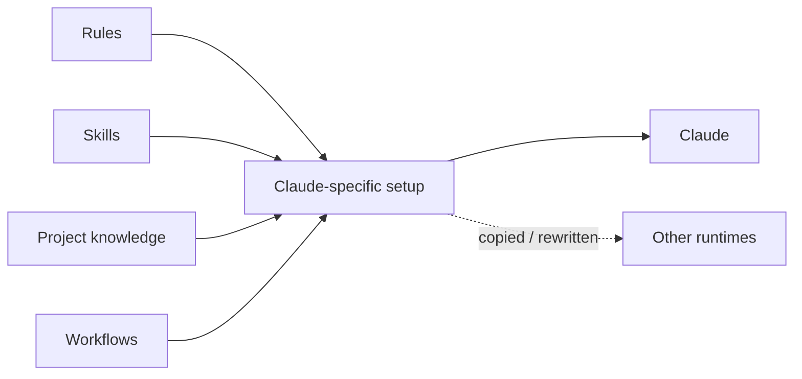
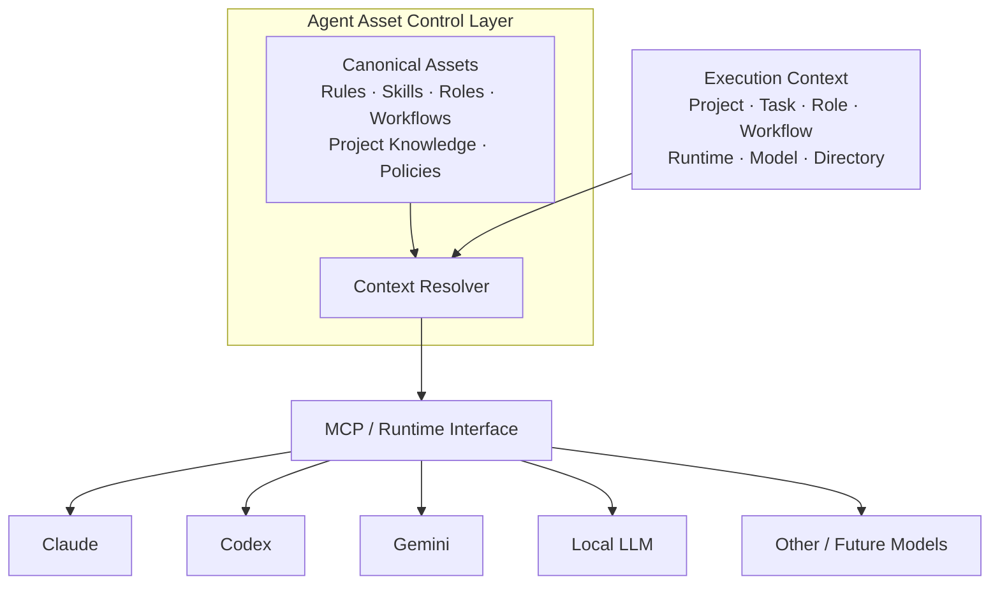
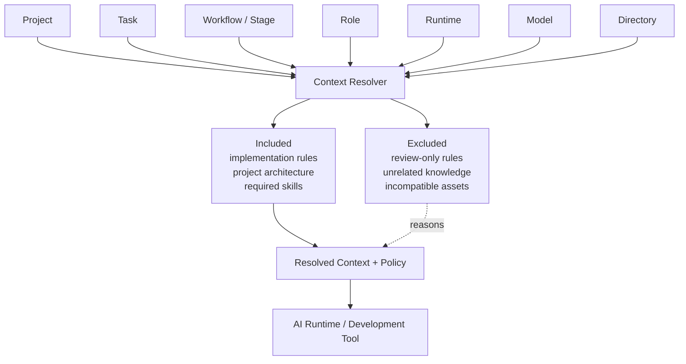
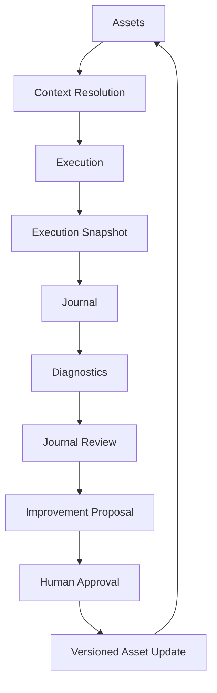
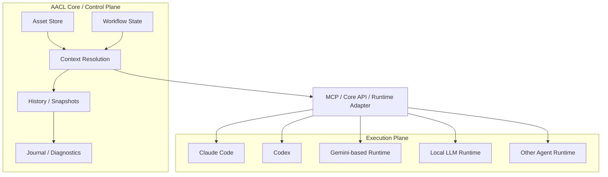

# Agent Asset Control Layer

A local-first control layer for the knowledge, rules, workflows, and safeguards used by AI development tools.

> **Status:** early-stage. There is nothing to install yet — the MVP is being built in the open.

## Why this exists

AI coding tools become much more useful once you start teaching them how you work.

You add instructions for your projects. You create reusable skills. You define review rules,
workflows, model preferences, safety checks, templates, and project-specific knowledge.

At first, this is manageable. Then the same ideas begin to appear in several places.

A rule is copied into another project. A skill is rewritten for another runtime. A useful workflow
lives in one tool but not another. Some instructions are always loaded even when they are irrelevant.
And when something goes wrong during an AI-assisted task, the lesson often stays in that one session
instead of improving the setup for next time.



The problem is no longer just “how do I write a good prompt?”

It becomes:

**How do I manage the growing body of knowledge and policy that my AI development tools depend on?**

Agent Asset Control Layer is an attempt to solve that problem.

It acts as a control plane for reusable AI development assets and for the rules that determine when
those assets apply. Context resolution is a central part of that job, but the system also manages
asset lifecycle, workflow definitions and state, execution metadata, history, diagnostics, and the
feedback loop that improves assets over time.

## The basic idea

AI development knowledge should not belong to one model or runtime.

Instead of letting each tool, project, or runtime maintain its own independent copy of your AI
development setup, keep those reusable pieces as shared **assets** managed by AACL.

An asset can be a skill, rule, role, workflow, guardrail, template, checklist, piece of project
knowledge, routing policy, or capability definition.

“Asset” is a shared management boundary, not a claim that all of those things have identical
semantics. They can share identity, metadata, scope, dependency, lifecycle, versioning, and history
while still keeping type-specific validation, merge behavior, and execution meaning.



The model is not the source of truth for how development work should be performed. AACL keeps the
reusable development knowledge outside any one provider or runtime, resolves what applies, and
provides the result through a runtime-facing interface.

MCP is a natural interface for runtimes that can discover and retrieve AACL-managed context
directly. Other integrations can use the same Core through adapters, host injection, or other
runtime interfaces without changing the canonical asset model.

**The model can change. The development knowledge remains.**

## Resolve, don't dump

The Core does not simply load every asset into every execution.

The answer may depend on:

- which project is open
- what task is being performed
- which workflow stage is active
- which role is running
- which provider, runtime, or model is being used
- which directory or part of the project is being worked on

The resolver evaluates those conditions, decides which assets apply, explains why they were selected
or excluded, and produces the context and policy for the target runtime.



The same canonical assets can therefore produce different context for different executions. An
Implementer using a local model does not need the same context as a Reviewer using Claude, Codex,
Gemini, or another runtime.

The resolver is the Core's decision boundary for applicability. Runtime adapters and clients may
translate or present the result, but they should not silently reinterpret which assets apply.

Agent Asset Control Layer does **not** replace an AI coding runtime, model provider, IDE, MCP
implementation, or agent framework. It sits between your reusable development assets and those
systems, providing a consistent way to manage, resolve, explain, and apply them.

## What this should make easier

### Keep reusable AI development knowledge in one place

Skills, rules, workflows, roles, guardrails, templates, project knowledge, and related assets can
be managed through one canonical model instead of being independently maintained for every runtime.

The common model handles shared management concerns without erasing the differences between asset
types. A workflow can remain a workflow, a guardrail can remain an enforcement policy, and a skill
can retain its own invocation semantics while still participating in the same management and
resolution system.

The source of truth remains human-readable and versionable, so assets can still be inspected,
diffed, reviewed, and edited directly.

### Give each execution the context it actually needs

Not every rule or skill belongs in every session.

The resolver evaluates the current project, task, workflow, role, runtime, model, directory, and
other relevant conditions before deciding what applies. Mandatory policies, overrides,
dependencies, conflicts, and disabled assets are handled explicitly rather than through implicit
“last one wins” behavior.

The resolution result includes both decisions and reasons. Inclusion, exclusion, override,
unavailability, degradation, and conflict are part of the result rather than hidden implementation
details.

This makes it possible to answer questions such as:

- Why was this rule included?
- Why was this skill unavailable?
- Which project setting overrode the default?
- What changed when the model changed?

### Use workflows without turning one prompt into the whole system

A workflow describes the stages that exist, the roles involved, and the transitions that are
allowed.

The orchestrator remains responsible for runtime decisions such as delegation, retry, fallback,
acceptance, or rejection. The Core provides the workflow definition, current state, resolved
context, available choices, and policy constraints needed to make those decisions.

This keeps workflow structure, orchestration decisions, and actual model execution as separate
responsibilities.

### Understand what an AI execution was actually given

Execution snapshots record the context around a run: the assets and revisions that were selected,
the active project, role, runtime and model, and the reasons behind the resolution result.

The goal is not to pretend that a model execution can be reproduced perfectly. The goal is to make
its **development context** inspectable later.

### Improve the system from real usage

The project also treats AI development assets as something that can improve over time.



A journal captures useful observations from real work. Diagnostics can identify patterns such as
conflicts, duplication, missing dependencies, unused assets, or unnecessarily expensive context.
A review can then turn those signals into an improvement proposal.

Changes are proposed and reviewed rather than silently rewriting important rules behind the user's
back.

## How it fits together

AACL is the control plane. Models and agent runtimes remain the execution plane.



The **Core** owns source-of-truth semantics for assets, scope and policy resolution, workflow state,
history, snapshots, diagnostics, and related domain behavior.

The resolver is where the Core turns canonical assets plus execution conditions into an explicit,
explainable result. Materializers and adapters consume that result; they do not become alternate
policy engines.

Clients such as the VS Code extension provide the working interface. They can supply editor and
workspace context, display resolved context and workflow state, and connect the Core to supported
AI runtimes without duplicating the Core's domain rules.

A useful mental model is:

> **AACL holds the reusable development brain; models provide the reasoning and execution.**

Claude Code and Codex are the initial runtime targets for the MVP. The architecture itself is
runtime-neutral: Gemini-based runtimes, local LLMs, and future agent runtimes should be able to use
the same canonical assets and resolution semantics through compatible interfaces.

## Design principles

- **One source of truth.** Reusable assets should not have to drift across tool-specific copies.
- **Shared management, distinct semantics.** Asset types can share lifecycle and resolution infrastructure without being forced into identical behavior.
- **Resolve, don't dump.** Give each execution what it needs instead of loading everything by default.
- **Resolution is a Core decision.** Applicability is decided centrally and should not be silently reinterpreted by adapters or clients.
- **Explain decisions.** Inclusion, exclusion, override, conflict, degradation, and unavailability should be inspectable.
- **Local-first and private-first.** Single-user local operation is a first-class deployment model.
- **Runtime-neutral.** Core assets should not be defined by one provider's configuration format.
- **Interface-neutral.** MCP is a primary runtime-facing integration path, but the Core model is not coupled to one transport.
- **Human-approved evolution.** The system may detect and propose improvements, but important changes remain reviewable.

## Installation

Not available yet. Installation instructions will be added once the MVP is usable.

The planned local setup consists of:

- a **Core service** that manages and resolves assets
- a **Core UI** for asset management, preview, history, and diagnostics
- a **VS Code extension** that acts as the everyday development workbench
- runtime-facing interfaces, including MCP where supported, for AI development tools

The first version targets local, single-user use. Remote and team deployments come later and are
not required for local operation.

```text
Phase 1: single-user local Core
Phase 2: single-user remote Core / multi-device use
Phase 3: multi-user team Core
```

## Technology direction

The current plan is:

- Core domain and service: TypeScript / Node.js
- Desktop Core UI shell: Tauri 2 with a TypeScript frontend
- Asset source of truth: human-readable filesystem files
- Revision history: Git-compatible history backend
- Optional index / runtime storage: SQLite where useful
- Interfaces: local service API and MCP-facing interface

Rust may be introduced later for system-boundary components where stronger isolation,
reliability, or performance is useful, such as process supervision, guardrail execution, file
watching, credential integration, or performance-sensitive paths.

## Roadmap

The MVP is intended to be useful for day-to-day single-user AI development, not just demonstrate a
resolver.

Development is currently grouped into three broad stages:

1. Canonical assets, shared contracts, context resolution, preview, and initial runtime materialization
2. Workflow state, orchestration bridge contracts, runtime integration, and execution snapshots
3. History, journal, diagnostics, context-cost metrics, and the learning loop

Claude Code and Codex are the initial adapters used to prove the architecture. Broader runtime and
provider support can follow without changing the canonical asset model or resolution semantics.

Team sharing, multi-user access control, and remote hosting are post-MVP work.

## License

Licensed under the Apache License 2.0. See [LICENSE](LICENSE).
