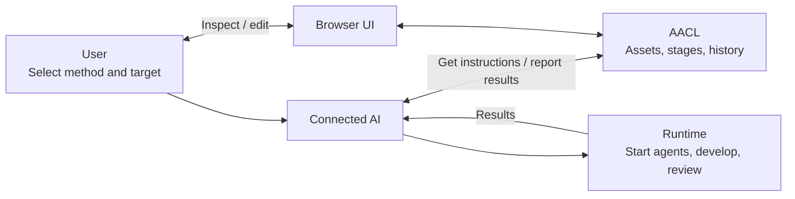
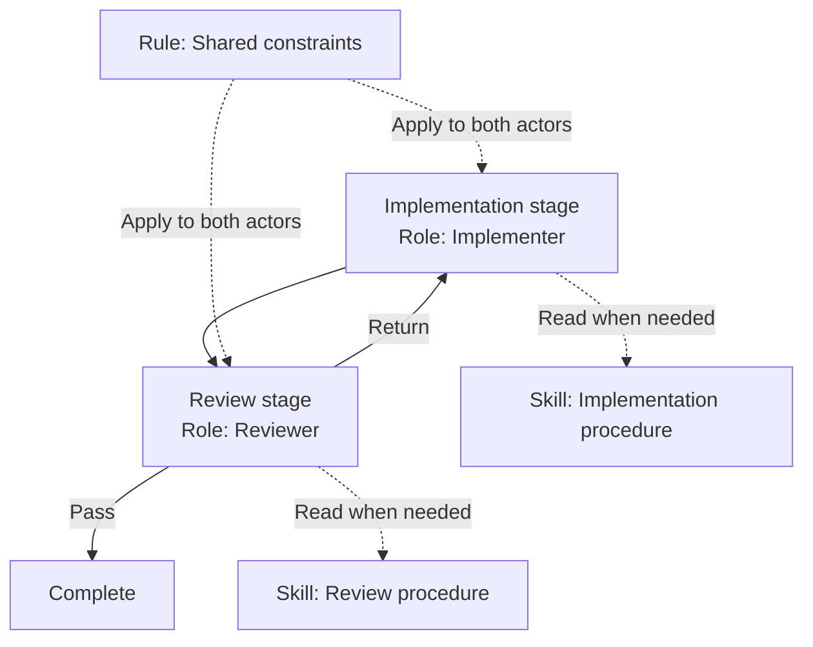
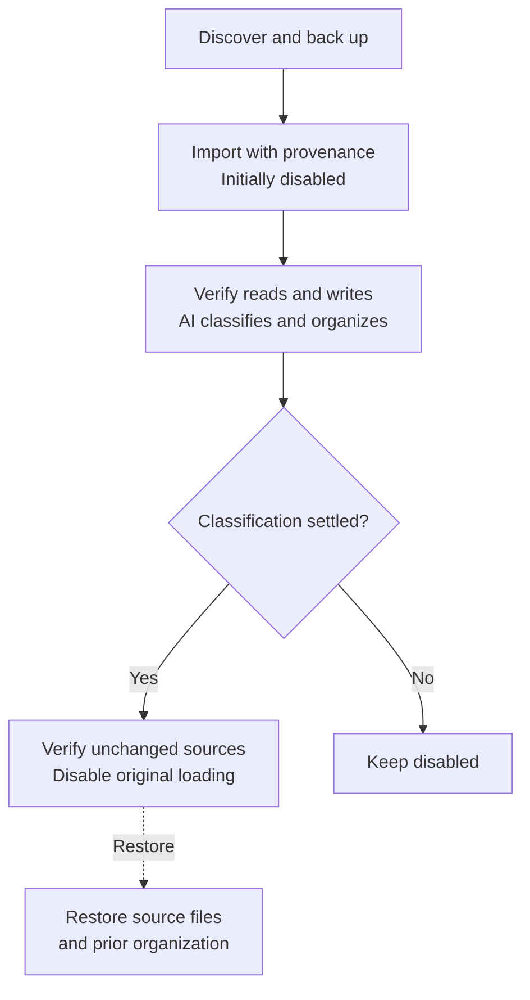
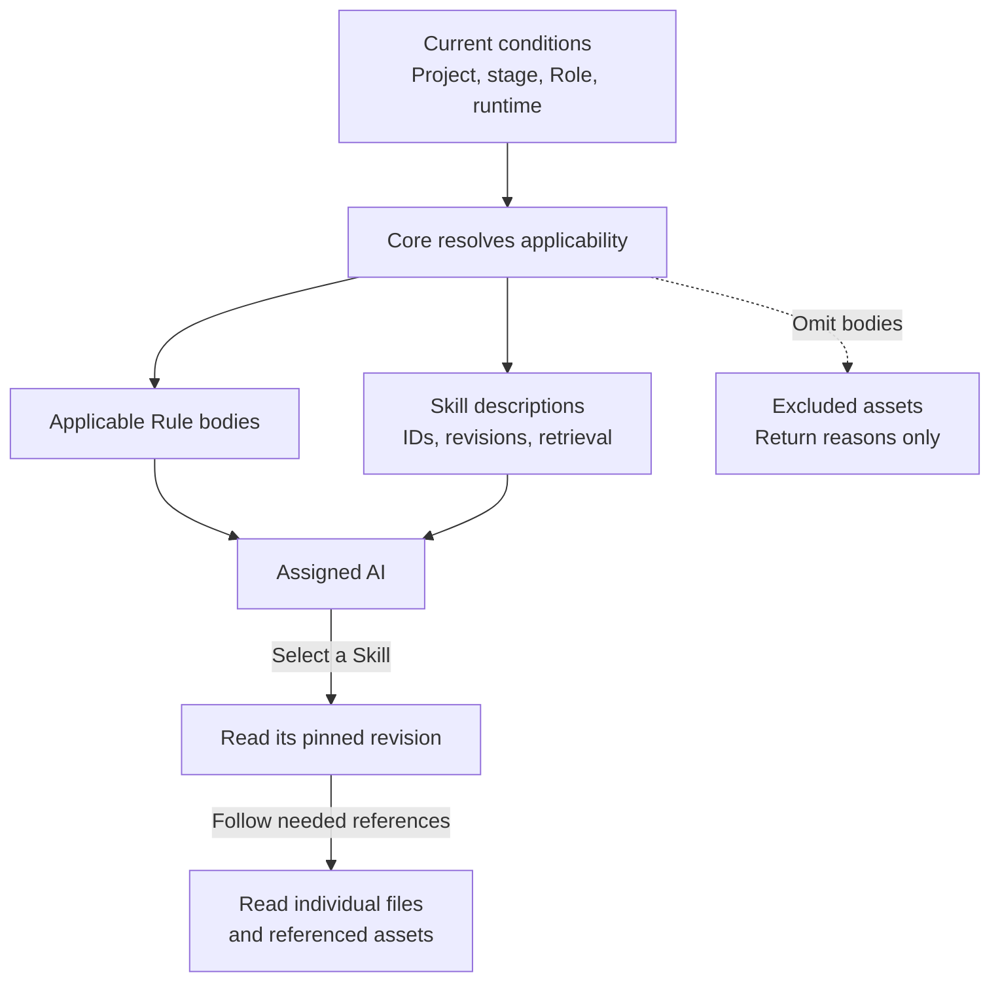
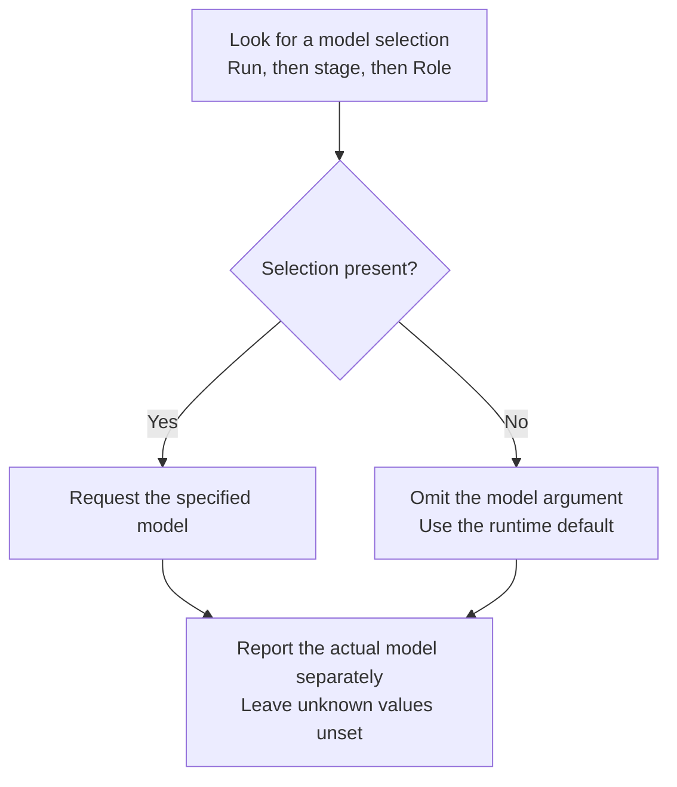
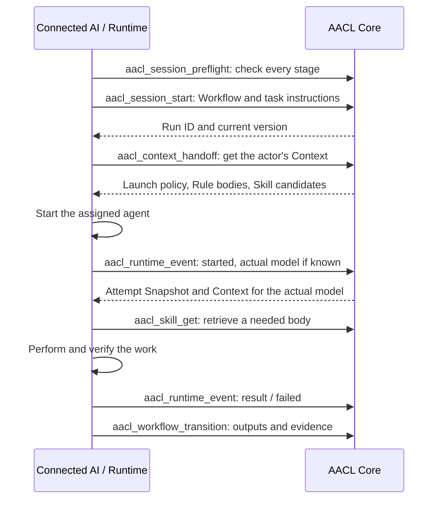
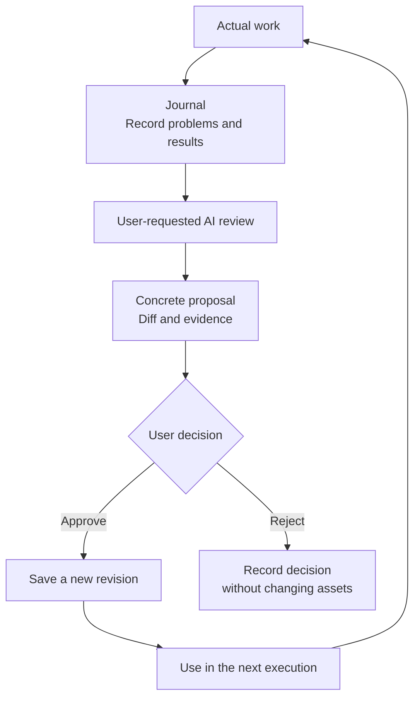
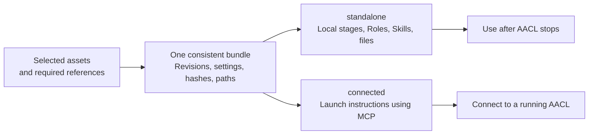

# Agent Asset Control Layer

**English** | [日本語](README.ja.md)

**AACL is a local app for saving AI development methods, reusing them, and improving them from execution records.**

Import existing instructions or ask the AI to create a method. Next time, select the saved Workflow and give it this task's target.

```text
/issue-development #123 Fix the login failure
```

This example assumes you have registered `issue-development`. AACL manages the method and its state. The connected AI runtime performs code changes and reviews.



**Available now:** local Core, browser UI, MCP, CLI, asset onboarding, and standalone file export. The Core service stores data and validates operations. MCP is the protocol through which AI clients call those operations; the CLI provides terminal commands.

## Get started

Use Node.js 24 or newer. Run these commands from the repository root:

```sh
npm ci
npm run build
npm start
```

| Interface      | Setup                                                                                      |
| -------------- | ------------------------------------------------------------------------------------------ |
| Browser UI     | Open `http://localhost:4780`.                                                              |
| MCP over HTTP  | Connect your AI client to `http://localhost:4780/mcp`.                                     |
| MCP over stdio | Keep the Core running. Set this repository as the working directory and run `npm --silent run mcp`. |

The stdio process bridges to the running Core. The `--silent` option keeps npm banners out of the MCP protocol stream. Once connected, ask the AI to register your project and import and organize existing development instructions. If you have no assets, ask it to create a Workflow or add the editable starter through the UI. Model registration is optional.

| Environment variable | Purpose and default                                                  |
| -------------------- | -------------------------------------------------------------------- |
| `AACL_DATA_DIR`      | Core storage directory; defaults to `.aacl-data` in this repository. |
| `PORT`               | Core port; defaults to `4780`.                                       |
| `AACL_URL`           | Stdio bridge destination; defaults to `http://127.0.0.1:4780/mcp`.   |
| `AACL_API_URL`       | CLI destination; defaults to `http://127.0.0.1:4780`.                |

The Core listens on `127.0.0.1`. If you change its port, update the AI and CLI connection settings too.

## Save methods as assets

An **Asset** is reusable instruction or knowledge. Assets have IDs, revisions, applicability conditions, and relationships.

| Type        | What it stores                                                                 |
| ----------- | ------------------------------------------------------------------------------ |
| Workflow    | Stages, assigned Roles, delegation, outputs, returns, and completion criteria. |
| Role        | A responsibility and its expected outputs.                                     |
| Skill       | Procedures, knowledge, and supporting files used by the current actor.         |
| Rule        | Instructions that apply when their conditions match.                           |
| Task Type   | Work objectives, quality criteria, and constraints.                            |
| Capability  | External tool connection and permission information.                           |
| Other types | Project knowledge, policies, templates, and unclassified assets.               |

A Workflow assigns responsibility. Each actor uses the Skills it needs. This example separates implementation from review:



A Skill does not choose actors or models. It can describe ordered steps performed by the same actor. Delegation and stage control belong in a Workflow. Legacy `skill.steps` remain readable but are not executed; new writes are rejected.

Repository changes require explicit launch of a Workflow that permits development. Conversations without a Workflow and standalone Skills stay in advisory or preparation mode. Editing AACL assets is a separate management operation authorized by the user's request.

The UI lets you edit stages, responsibilities, outputs, and return paths. Screenshots show the current Japanese UI with example data.


## Import existing instructions

Onboarding backs up and imports assets, verifies the connection, and lets the AI organize them before disabling the original automatic loading. You can check the connection and content while the source files remain in place. Directory discovery targets instruction entry points and instruction folders, not ordinary project documentation. Import a README only by explicitly selecting its file path for reuse; README files stay in place during cutover, including those bundled with Skills.

The Assets import dialog registers a single Markdown file immediately as an enabled asset. It does not retain its original path or hash. For folder migration, backup, connection verification, cutover, and restoration by onboarding ID, use the copyable AI request in that dialog. Imported Skills propose their frontmatter name, and you can edit it before saving.



A file is not classified as a Skill just because it lives in a `skills` directory. The AI reads its actual behavior and can split one source into Workflow, Role, and Skill assets. AACL records output IDs, classification reasons, unconverted parts, and provenance.

Resume interrupted work with its onboarding ID. Cutover and restore verify file contents and asset revisions; later edits are not overwritten. Credentials, connection settings, histories, and caches are not imported as asset bodies.

Connection setup is available for Codex, Claude, and Cursor. Unsupported formats and plugin-managed assets remain in place with an explanation. See the [operating guide](docs/mcp-operations.md) (Japanese) for the full procedure.

## Deliver only the instructions needed

**Context is the information delivered to an actor.** The Core resolves it from the Project, Workflow, stage, Role, task type, Runtime, model, directory, and other conditions. A Runtime is the environment that starts AI agents and runs tools.

Initial Context includes applicable Rule bodies and Skill descriptions. The AI selects and retrieves Skill bodies and supporting files when needed.



Different condition dimensions combine with AND. For example, an asset scoped to `Role = reviewer` and `Model = model-a` applies only when both match. Projects can also disable assets, replace them, or override their conditions.

When several relationships select the same Skill, the candidate appears once and retains its selection reasons. Candidate presentation, body retrieval, and reported use are separate records. Retrieval alone does not count as use.

The execution UI shows the current stage's Context and Skill candidates.


## Leave model selection optional

Role and model are separate settings. When a model is specified, precedence is the explicit run selection, then the stage setting, then the Role binding.



An omitted model does not mean “use the parent AI's model.” If a Runtime cannot honor an explicit selection, AACL reports a conflict rather than ignoring the selection.

Requested and reported actual models are stored separately. Runtimes may report unregistered models, but applying model-specific assets requires a matching model configuration. A Workflow that requires a particular model or a different model for review cannot advance or complete without confirming that constraint through execution reports.

## Use a Workflow from an AI client

Read `aacl_bootstrap` or `aacl://bootstrap` after connecting. Obtain exact arguments from the connected server's MCP tool definitions.

A session start request creates a prepared execution. The Runtime performs the actual work. This is the basic call sequence for one stage:



A **Snapshot** pins asset revisions, settings, and Context. A start report preserves the preparation record and creates another Snapshot reflecting the actual model.

Rules for AI clients:

1. Do not invent executions or Journals to create or organize assets. Record `userRequest`, the change reason, and the actual requesting user.
2. Before development, request a handoff with `action: "development"` and check `developmentAllowed`.
3. Call `aacl_skill_get` with the returned `id`, `revision`, and `snapshotId`. Use `usage: "inspect"` for reading and `usage: "use"` to report use. Retrieve supporting files with `aacl_asset_file_get` at the same revision.
4. Use the latest `expectedVersion` for updates. Where request replay is supported, reuse the same payload and `requestId`. A start report's `attemptId` identifies the real attempt.
5. Inspect state with `aacl_run_get` and `aacl_context_handoff_preview`. These reads do not increment the run version or create Snapshots.
6. Transitions must follow defined stages and supply outputs and completion evidence. Collect fresh evidence after a return. To restart with the latest Workflow, use `aacl_run_restart` to create a separate execution.

## Improve from records

A **Journal** records problems and results observed in a real attempt. At the user's request, the AI reviews these records and proposes a change.



Use `aacl_asset_propose` or `aacl_asset_change` for initial authoring and direct change requests, and `aacl_proposal_decision` for approval decisions. Reviews based on execution records start with `aacl_review_start`. The built-in `aacl-asset-authoring` Skill supports authoring and classification during consultation.

Assets, model bindings, and Project settings retain before/after values and change reasons and can be restored. Past Snapshots remain unchanged. Comparison views distinguish preparations from attempts, requested from actual models, and asset and setting revisions.

## Export files

The built-in `aacl-asset-export` Skill and `aacl_export_bundle` retrieve selected assets and their required references together. Assets, relationships, and settings come from one point in time, so export does not mix revisions.



| Mode         | Requirements                                                                                                         |
| ------------ | -------------------------------------------------------------------------------------------------------------------- |
| `standalone` | Includes Workflow delegation, return instructions, and referenced files. The exported result does not need the Core. |
| `connected`  | Requires MCP. Configure the connection in the destination environment.                                               |

Output formats are `codex`, `claude`, `cursor`, and `generic`. Source connection endpoints are omitted in both modes. Check `limitations`; if `ready: false`, resolve the blocking conditions before use. Export alone does not guarantee model selection support or permission enforcement.

For example, save this as `export-input.json`, replacing the asset ID with a registered one:

```json
{
  "assetIds": ["issue-development"],
  "mode": "standalone",
  "runtime": "codex"
}
```

Keep the Core running and export to a directory that does not yet exist:

```sh
npm run cli -- export-bundle export-input.json ./exported-assets
```

If an AI installs the files, it should check the destination and existing-file diff, then write and verify them against the output specification. Context Preview provides a copyable standalone-export request for the selected Workflow and additional candidates, with a choice of runtime format. Its Codex/Claude file-generation buttons, `aacl_materialize`, and CLI `export` generate connected output that requires MCP.

## Implementation and verification

The Core uses TypeScript, Node.js, and Express. The UI uses React and Vite. Canonical data is stored as JSON: shared assets and state in the Core's storage directory, and Project assets in each project's `.aacl` directory.

```sh
npm run dev                      # Development server
npm run check                    # Type check, build, server tests
npx playwright install chromium  # First-time setup
npm run test:ui                  # Browser tests
```

Browser tests use port 4781 and temporary data. The September 9, 2026 implementation checks passed 141 server tests and 23 browser tests.

The current app supports local, single-user operation. A VS Code extension, dedicated desktop shell, multi-user management, and remote operation are not implemented. The Core validates operations that pass through it. The Runtime handles model invocation, external tools, and OS-level restrictions. Execution reports and estimated Context size alone do not establish an improvement in development quality.

Further documentation is currently in Japanese:

| Topic                                              | Document                                                                           |
| -------------------------------------------------- | ---------------------------------------------------------------------------------- |
| Onboarding, daily operation, restore, and export   | [Operating guide](docs/mcp-operations.md)                                          |
| Type contracts, proposals, and revision comparison | [Core contracts](docs/core-contracts.md)                                           |
| Current requirements                               | [Requirements v15](agent-asset-control-layer-requirements.md)                      |
| Implementation and verification scope              | [September 9 implementation report](docs/improvement-implementation-2026-09-09.md) |
| Skill, Workflow, model, and export design          | [Design notes](docs/skill-workflow-model-and-export-design.md)                     |

Licensed under the [Apache License 2.0](LICENSE).
