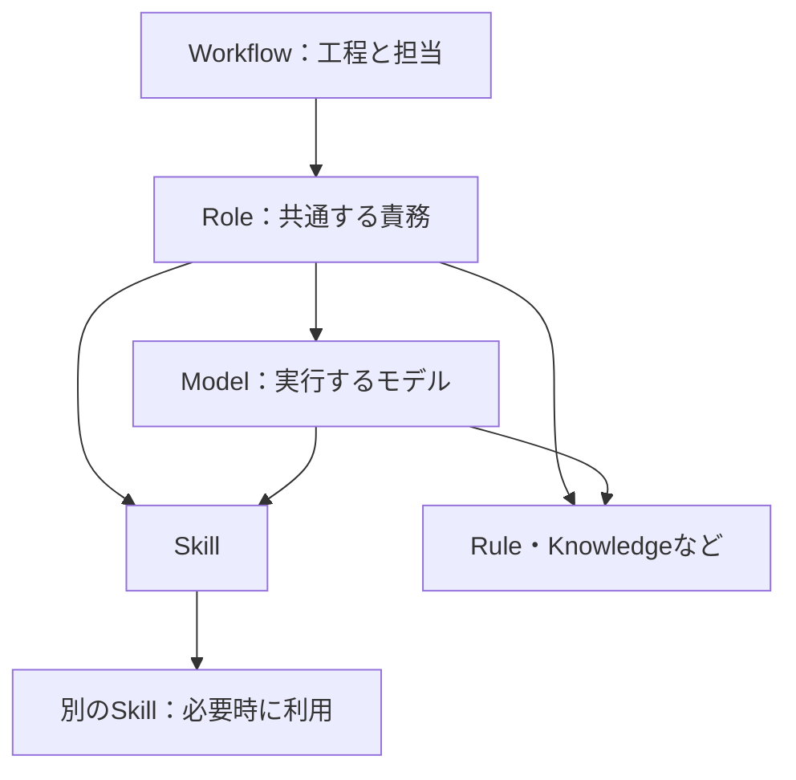

**AACLの利用方針更新 — 自動導入、MCPによる日常操作、資産の紐づけ**

対応後の実装と検証範囲は[実装確認表](improvement-implementation-2026-09-09.md)、現在の操作方法は[運用ガイド](mcp-operations.md)に記載しています。以下は実装に先立って合意した設計案です。

2026年9月9日。ユーザーが提示した方向を、製品の目標として具体化した設計案です。実装済み機能の説明ではありません。既存の[総合改善インプット](//wsl.localhost/Ubuntu/home/owner/dev/aacl/docs/integrated-improvement-input-2026-09-09.md)に対し、日常操作と導入経路の方針を更新します。

**中心となる方針は、既存のAI開発資産を引き継ぎ、初回にAIが整理し、以後は会話とMCPで運用できることです。** 人間は、確認や調整が必要なときにUIを使います。UIで可能な既存の編集操作も残します。

Workflowは開発工程の最上位に置きます。導入時にすべてのWorkflowを手作業で完成させる必要はありません。まず既存資産を取り込み、利用できるRoleと紐づけを整えます。新しい開発方法が必要になったら、会話からWorkflowを作成・変更できるようにします。

**ユーザーが示した方向と、本資料で具体化する点**

| 項目 | ユーザーが示した方向 | 本資料での具体化・提案 |
|---|---|---|
| 導入対象 | ユーザー環境の.codex、.claude、.cursor、その他IDEのフォルダを探索します。後から対象を選べてもよいです。 | ホストとパスを区別した探索結果を作り、既定候補と追加指定に対応します。 |
| バックアップ | 見つかったフォルダを_backup等へリネームし、その内容を取り込みます。 | バックアップ・取り込み・接続確認・切り替えを一続きにします。フォルダ全体を最初にリネームする方式には、後述の修正を提案します。 |
| 自動導入 | Skill、Ruleなどへ自動分類し、分類できないものはotherとして受け入れます。 | 原文、補助ファイル、元の場所を保持します。otherは未分類のAI開発資産として扱います。 |
| 初回整理 | AIがMCPの開通を確認し、otherの分類と既定Roleへの紐づけを行います。 | 初回整理への依頼を権限の根拠として、一括処理と結果報告を行います。不明点だけを残します。 |
| 日常操作 | 基本的に人間はUIを触らず、MCP経由で実行します。 | 検索、設定、Workflow起動、更新、改善までを会話とMCPで完結できるようにします。 |
| UI | 資産と紐づけの確認が中心で、現在と同等の操作も残します。 | 閲覧・関係の調整・履歴確認・手動操作を同じ正本に対して提供します。 |
| 関係の方向 | Workflow、Role、Model、その他資産の順とし、SkillからRoleやModelを選びません。 | 上位から実行条件を決め、下位資産を解決します。下位から上位の担当や権限を変更しません。 |
| Skill同士 | Skill AがSkill Bに言及していたら自動で紐づけたいです。 | 必須利用、条件付き利用、資料参照を区別して保存します。工程の定義が必要ならSkill内の手順として表現します。 |

**導入は、既存環境を使える状態に保ちながらAACLへ移します**

フォルダを丸ごと先にリネームする部分は、変更を推奨します。今回、内容を読まずに直下のファイル名とフォルダ名を確認したところ、次のものが同居していました。

| 確認した場所 | 存在を確認した項目の例 |
|---|---|
| [Windows側の.codex](C:/Users/owner/.codex) | skills、rules、plugins、sessions、auth.json、config.toml |
| [Windows側の.claude](C:/Users/owner/.claude) | skills、rules、agents、plugins、projects、sessions、settings.json |
| [Windows側の.cursor](C:/Users/owner/.cursor) | extensions、plugins、projects、mcp.json |

認証や接続設定、実行記録も同じ場所にあるため、先に親フォルダを移すと、取り込み後の整理を担当するAI自身が接続できなくなる可能性があります。実際にリネームして障害を再現したわけではありません。設定・認証情報の内容は読んでいません。

推奨する導入手順は次のとおりです。

1. **対象を探索します。** ユーザー単位とProject単位を区別し、どのホストのパスかを保存します。追加指定した場所も同じ仕組みで扱います。
2. **元データをバックアップします。** 元の配置を保った退避コピーと、復元に必要な対象一覧を作ります。バックアップ名が既存のものと衝突しても上書きしません。
3. **AACLへ取り込みます。** Skill・Ruleなどの資産と補助ファイルを読み込みます。同じ内容が複数環境にある場合は出所を保持し、重複候補として扱います。名前が同じだけでは統合しません。
4. **MCP接続を準備し、実際のAIから開通を確認します。** 認証・接続に必要なRuntime設定は利用可能な状態に保ちます。Coreへの疎通に加え、取り込み済み資産の取得と、初回整理の結果を保存できることを確認します。
5. **AIが初回整理を行います。** otherの分類、Skill間の関係の抽出、既定Roleへの紐づけを行います。整理前後と理由を保存し、まとめて報告します。
6. **元の資産の読み込みをAACL管理へ切り替えます。** 必要な資産の取得と接続を確認してから、Runtime固有の方法で元の自動読込を止めます。資産用フォルダや対象ファイルのリネームは、この段階で行えます。AACLを使うための接続設定と最小限の案内を元の環境に配置します。

目標は、AACLと元のSkill・Ruleが両方から読み込まれる状態を残さず、同時にRuntimeの稼働に必要な設定を保つことです。形式ごとに必要な配置処理を行うAdapterが、この切り替えを担当します。

フォルダ全体を_backupへリネームする方式を採用する場合は、Runtimeの停止、必要な設定の復元、再起動と接続確認までを含む移行処理にする必要があります。実行中のAIに、そのAI自身が依存する環境を丸ごと移させる設計にはしません。

移行に失敗した場合は元の資産からの利用を継続でき、再実行しても同じ資産が増殖しないようにします。Runtimeごとの導入結果を保存し、一部だけ成功した状態も区別します。既存プラグインが管理するSkill等は、その更新方法を把握してから切り替え対象を決めます。

**otherは、分類待ちの資産を失わず受け入れる場所にします**

自動分類できないから取り込めない、という制約はなくします。otherには原文やファイルを保存し、後からAIが分類できます。

ただし、フォルダ内のすべてのファイルをotherとしてAIへ渡す設計にはしません。認証情報、実行履歴、キャッシュ、拡張機能の実体などは、移行元に存在する情報として扱います。必要なバックアップや接続設定の引き継ぎと、AIへ提供する資産への分類を分けます。AIへの指示・手順・知識に当たるか不明なものをotherにします。

資産の種類が確定しても、実行条件への紐づけは別です。Ruleに分類されたからといって、全Role・全Modelに自動適用する意味にはしません。共通適用、特定Role、特定Model、Project固有など、適用先も記録します。判断できない資産は取り込み済み・未紐づけとして保持できるようにします。

初回整理は、ユーザーが導入時に依頼した範囲で自動適用できるものとします。資産ごとのUI承認を必須にしません。曖昧な対応先、内容が競合する同名資産、既存の権限を広げる変更などは、会話で判断できる形にまとめます。初回整理を一つの変更のまとまりとして保存し、分類と紐づけを戻せるようにします。

**資産の構造は、上位から条件を決める関係として扱います**

Workflowは工程と担当を定め、Roleには利用するModelと資産を紐づけます。選ばれたModelにも、モデルに応じたSkillやRuleを紐づけます。下の図の矢印は、所有やコピーではなく、選択・適用・利用の関係を表します。

同じModelやSkillを複数Roleで再利用できるため、保存構造は一つの親だけを持つ木にはしません。UIではWorkflow、Role、Model、資産の順に展開でき、共有している対象は同じ資産として見えるようにします。

| 紐づけ | 意味 |
|---|---|
| Workflowの工程からRole | その工程で担う責務を決めます。 |
| RoleからModel | 利用可能なモデルや既定の割り当てを決めます。実行時には使うモデルを確定します。 |
| RoleからSkill・Rule等 | その責務に必要な手順・指示・知識を適用します。 |
| ModelからSkill・Rule等 | 選ばれたモデルに必要な補足手順・指示を適用します。 |
| Skillから別のSkill | 同じ実行の条件の下で、他の手順を参照・利用します。 |

RoleとModelの両方から同じSkillが選ばれても、本文を二重に渡しません。どちらから選ばれたかという理由は両方残します。

Modelに直接紐づけたRuleは、そのモデルが別のRoleで使われた場合にも候補になります。特定のRoleとModelの組み合わせだけに必要なら、その組み合わせを関係の条件として保存します。Project、Runtime、directory等も条件として残せます。表示上の上下関係だけで、Ruleの競合や優先順位を決めることはしません。

Skillの画面で「このSkillを使っているRole」を表示することは可能です。ただし、その表示は逆引きです。Skillを実行したことによって、そのRoleやModelまで自動選択することはありません。

otherは分類状態なので、RoleやModelと同列の実行主体にはしません。Skill、Rule、Knowledge等は最下位で並列に管理し、それぞれに適した意味で利用します。

**Skill内の言及は、自動で関係にできます。ただし関係の意味を残します**

Skill AにSkill Bが出てきた場合、導入・編集時に関係を抽出することを推奨します。単なる名前の出現と実際の利用指示を区別します。下記は本資料が作成した例です。

| Skill Aにある記述の例 | 保存する関係 | 実行時の扱い |
|---|---|---|
| 開始前にSkill Bの手順を必ず実施します。 | 必須の利用関係です。 | Bが利用可能であることを確認し、指示された位置で使います。 |
| 公開APIを変更するときはSkill Bを使います。 | 条件付きの利用関係です。 | 条件に当たる場合だけBを取得・利用します。 |
| 判断基準はSkill Bの説明を参照してください。 | 参照関係です。 | 必要な説明を取得できますが、Bの手順全体を自動実行しません。 |
| Skill Bを使わないでください。 | 利用を禁止する指示です。 | 名前が現れたことを理由に利用関係を作りません。 |

明確なIDやパスから対応を特定できる場合は自動で結びます。自然言語による意味の判断は、初回整理や編集時のAIが担当します。対応先が曖昧なら候補を保持し、別のSkillへ勝手に確定しません。

関係には、元の記述位置、対象のID、関係の意味、条件、整理理由を保存します。Skillの本文が変わった場合は、その本文から抽出した関係を再評価します。人間が明示して残した関係は、自動抽出の結果と区別します。

実行時のResolverは、保存済みの関係と条件を使います。毎回本文を読み直して関係を作り替えることはしません。この分担なら、AIによる自動整理と、実行時の再現性を両立できます。

また、AからBへの紐づけだけで、Bの本文全体を常に読み込む必要はありません。利用時に取得できるようにし、AとBが互いを無条件に呼び続ける関係は検出します。単なる相互参照は、実行の循環と区別します。

**Skill用の手順は、必要な場合に限って構造化します**

ユーザーが挙げた「skills用のワークフロー」は、Skillの中で複数Skillを組み合わせる手順として表現するのがよいと考えます。既存のWorkflowとの違いは、担当や開発権限を変えず、選択済みの条件の中で進めることです。

| 対象 | 定義するもの |
|---|---|
| Workflow | 工程、Role、モデルの割り当て方針、差し戻し、開発権限、実行全体の完了条件を定義します。 |
| Skill内の手順 | 利用するSkill、順序、条件、入力・出力の受け渡しを定義します。現在のRole・Model・権限を引き継ぎます。 |

単純な参照はSkill間の関係だけで足ります。順序や条件、結果の受け渡しが重要になった場合に、Skill内の手順として保存します。Skillを組み合わせるたびに、上位のWorkflowと同じ状態管理を要求しない設計を推奨します。

Skill内の記述に別のRoleやModelを使う指示が見つかっても、それだけで担当やモデルを変更しません。上位のWorkflowや割り当てに変更が必要な内容として扱います。

**会話とMCPを日常操作の入口にします**

現在のMCPは実行や提案の一部を扱えますが、Project・Modelの一覧、初期設定、Journalの選択やReview開始等には不足があります。新しい目標では、実行だけでなく運用に必要な操作もMCPに揃える必要があります。

| 会話で依頼することの例 | MCP経由で完結させる操作 |
|---|---|
| 取り込んだ資産を整理してください。 | 導入状況を読み、分類と紐づけを保存し、未確定な項目を報告します。 |
| reviewerが使うモデルとRuleを見せてください。 | Role、Model、適用する資産、条件、選ばれた理由を返します。 |
| このRoleのモデルを変更してください。 | 影響するWorkflow等を確認し、依頼された範囲で割り当てを更新します。 |
| このSkillが何を利用しているか見せてください。 | 必須利用・条件付き利用・参照を区別した関係を返します。 |
| いつものWorkflowでこのIssueを進めてください。 | 明示されたWorkflowと保存済みの方針を用いて開始・引き継ぎ・遷移を行います。 |
| 最近の実行から手順の改善案を出してください。 | 対象の観測を集め、提案し、ユーザーが認めた変更を保存します。 |

人間の承認が必要な変更も、UIへの移動を必須にしません。会話で変更内容を示し、ユーザーの指示に結び付いた承認として扱えるようにします。AIが自分で承認したという扱いにはしません。明示した依頼や設定済みの変更権限の範囲では、同じ確認を繰り返さず操作を続けます。

UIとMCPは同じ保存・検証・履歴の仕組みを使います。UIには確認と手動編集の機能を残し、MCPでは必要な対象だけを取得できる応答を提供します。

**既存要求から変更する点と、維持する点**

| 対象 | 更新する方針 |
|---|---|
| 初期Asset作成と紐づけ | ユーザーの導入依頼に基づくAI整理を、正式な作成・変更経路に加えます。Journalがないと作成できない構成を解消します。 |
| scopeと関係の確定 | 初回整理・明示的な編集依頼・改善Reviewを起点にできます。実行中のResolverは確定済みの関係を適用します。 |
| 人間の操作 | UIを必須の経由点にせず、会話とMCPによる操作を標準にします。 |
| Skill間の関係 | 本文から抽出する関係と、必要に応じたSkill内の手順を追加します。SkillからRole・Modelへの選択は行いません。 |
| 正本と履歴 | Coreを正本とし、出所、関係の根拠、変更理由、復元可能な履歴を維持します。 |
| 開発Workflow | 開発工程と権限の最上位という位置づけを維持します。初回の資産整理は、その後のコード開発の自動開始を意味しません。 |

照合先: [初期方針の所有者](//wsl.localhost/Ubuntu/home/owner/dev/aacl/agent-asset-control-layer-requirements.md:139)、[関係の確定とResolverの分担](//wsl.localhost/Ubuntu/home/owner/dev/aacl/agent-asset-control-layer-requirements.md:184)、[scopeと関係の現行要求](//wsl.localhost/Ubuntu/home/owner/dev/aacl/agent-asset-control-layer-requirements.md:815)、[既存資産の取り込み](//wsl.localhost/Ubuntu/home/owner/dev/aacl/agent-asset-control-layer-requirements.md:1143)。

**この方針が成立したかを確認する条件**

- 既存のSkill・Rule・補助ファイルを取り込み、接続設定を失わず、実際のAIから整理結果を保存できます。
- 未分類の資産はotherとして残り、認証情報や実行履歴が資産本文としてAIへ渡りません。
- 切り替え後、同じ資産が元のRuntime設定とAACLの両方から読み込まれません。
- 導入を中断・再実行しても資産が重複せず、移行前の状態へ戻せます。
- 初回整理で複数の資産を分類・紐づけでき、項目ごとのUI操作を要求しません。
- 通常の検索、設定変更、Workflow起動、改善提案はUIを開かずに完了します。UIの編集機能も使えます。
- 同じModelやSkillを複数Roleで共有でき、条件付きの紐づけと二重読込を正しく扱えます。
- Skill BがSkill Aから利用されても、選択済みのRole・Model・権限が変わりません。
- 明確な参照は自動で結ばれ、条件付き利用・資料参照・禁止の記述は異なる扱いになります。
- Skill本文の編集後に関係を更新でき、過去の実行は当時の関係と改訂で確認できます。

本資料では設計を具体化しました。環境フォルダの移行や、要求・README・アプリ実装の変更は行っていません。
